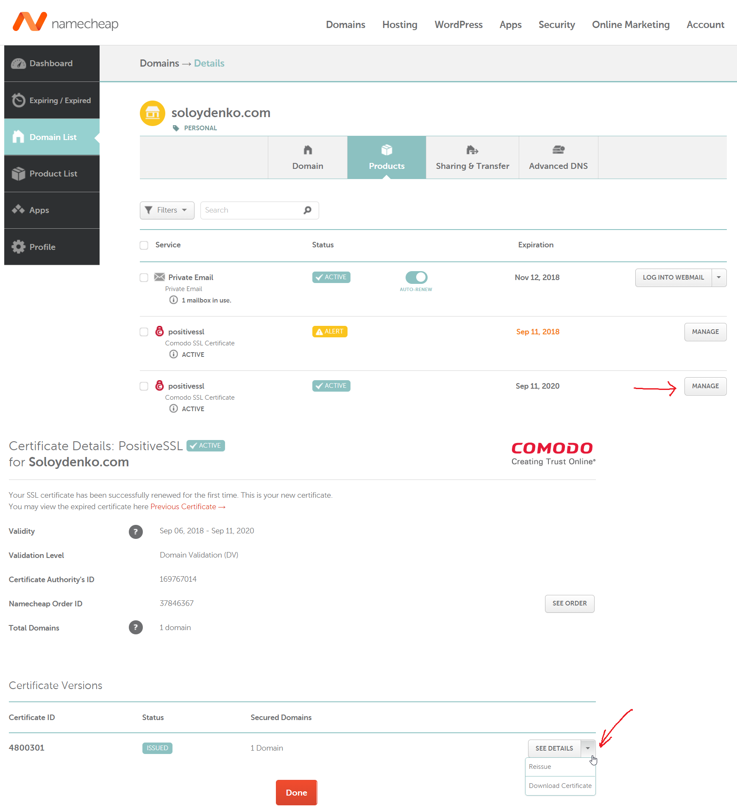
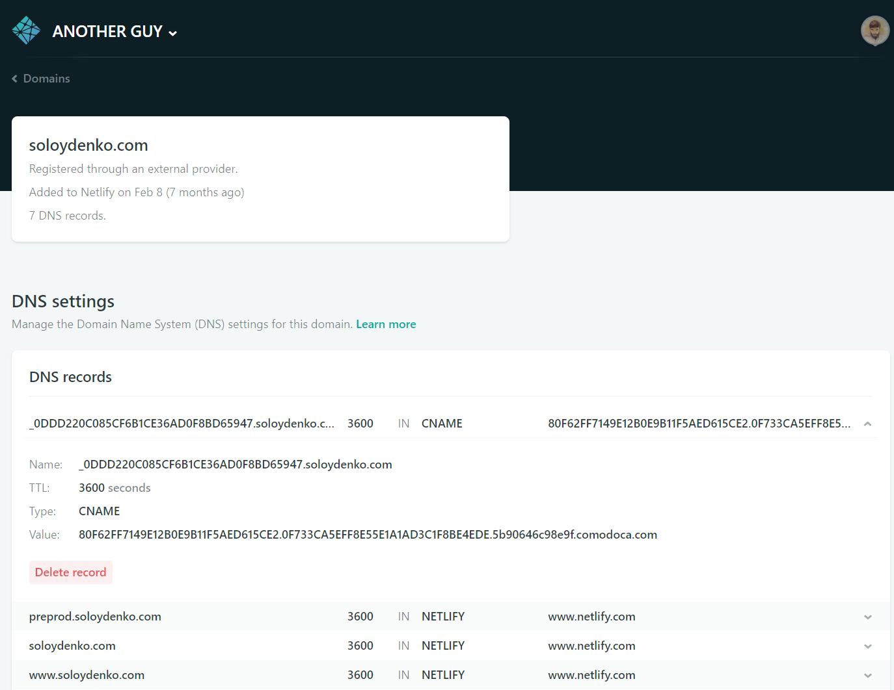
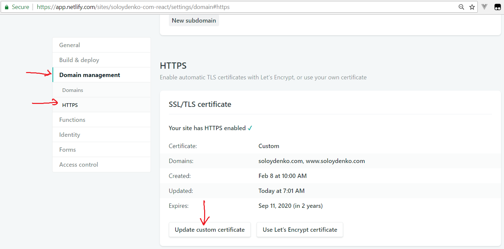

# Bash recipes

## Install Dot Net Core SDK on Mint

```sh
sudo add-apt-repository universe

wget -qO- https://packages.microsoft.com/keys/microsoft.asc | gpg --dearmor > microsoft.asc.gpg
sudo mv microsoft.asc.gpg /etc/apt/trusted.gpg.d/
wget -q https://packages.microsoft.com/config/debian/8/prod.list
sudo mv prod.list /etc/apt/sources.list.d/microsoft-prod.list
sudo chown root:root /etc/apt/trusted.gpg.d/microsoft.asc.gpg
sudo chown root:root /etc/apt/sources.list.d/microsoft-prod.list

sudo apt-get update

sudo apt-get install dotnet-sdk-2.2
```

## Bash

### Hardware

```sh
lspci                      # Enumerate system devices as a list

inxi -Fxz                  # Enumerate system devices in a human-friendly format
```

**If your wifi is slow when using Bluetooth try adding the following to `/etc/modprobe.d/iwkwifi.conf` and reboot:**

```sh
options iwlwifi bt_coex_active=0 swcrypto=1 11n_disable=8
```

### File system
```
find <path>          # Find all directories and files under `path`
find <path> -type f  # Find all                 files under `path`
find <path> -type d  # Find all directories           under `path`
```

### Text manipulation
```
cut -d 'X' -f      3      # Split input by delimeter X and emit 3rd field
cut -d 'X' -f     3-      # Split input by delimeter X and emit all fields starting with 3rd
cut -d 'X' -f     -3      # Split input by delimeter X and emit fields from 1st till 3rd
cut -d 'X' -f    2-4      # Split input by delimeter X and emit fields from 2nd till 4th
cut -d 'X' -f  1,3-5      # Split input by delimeter X and emit fields 1st and from 3rd till 5th

tr   'a'   'z'            # Replace 'a' by 'z'
tr 'abc' 'xyz'            # Replace 'a' by 'x', 'b' by 'y', and 'c' by 'z'

sed -e 's/foo/bar/g'      # Replace 'foo' with 'bar'
```

## Git

```
git update-index --assume-unchanged <path>          # Stop detecting changes in <path>

git shortlog --summary --numbered                   # Show user and commits stats in Git; same as `git shortlog -sn`
git log --pretty="%an %ae%n%cn %ce" | sort | uniq   # List users and their emails
```

## Bash + Git

```
ssh-keygen -t rsa -C "<email>@<email>.com"                        # Generate SSH key pare
cat ~/.ssh/id_rsa ~/.ssh/id_rsa.pub                               # Check private and public keys
git config core.sshCommand "ssh -i ~/.ssh/id_rsa -F /dev/null"    # Configure CURRENT Git repo to use private key
git push <remote> master:master                                   # Make a push to target <remote> as usual
```

## Vim

```
vim -b <file> # Open text file with binary characters
```

## .NET Core

```
ASPNETCORE_ENVIRONMENT=Development dotnet run   #  Run app under certain   environment configuration
ASPNETCORE_URLS="https://*:57383"  dotnet run   #  -//-  -//-  -//-  -//-  port
```

## NPM

```
npm init # Initialize package.json
```

### Where are the global packages located?

```sh
yarn global bin

npm bin -g
```

### What are the installed packages?

```
npm list -g     --depth=0 # Global
npm list --prod --depth=0 # Production
npm list --dev  --depth=0 # Development
```

### Install

*Call `install` from the directory containing `node_modules`*

```
npm outdated                   # Shows the packages that better be updated
npm i[nstall] <packageName> -g # Install package globally
npm i         <packageName> -S #                 as production ("dependencies")
npm i         <packageName> -D #                 as development ("devDependencies")
```

### Uninstall

```
npm un[install] <packageName> -g # Uninstall globally installed package
npm un          <packageName> -S #           from "dependencies"
npm un          <packageName> -D #           from "devDependencies"
```

### CRA

```
npx create-react-app wishlist --typescript
```

### Package Update

**via `npm-check-updates` aka `ncu`**

```
npm install -g npm-check-updates  # Install `npm-check-updates` as an npm command.

ncu --upgradeAll                  # Upgrade all with making changes to package.json.
rm -rf node_modules               # Remove existing npm package artifacts.
npm install                       # Reinstall packages from scratch.
npm outdated                      # Verify the result.

ncu -g
npm install -g <package>@<ver>
```

## Json-Server

```
npm install -g json-server
```

## Hotel

```
npm install -g hotel

hotel start

hotel add 'json-server --watch db.json --port 3001' -p 3001 -n fake-db -o fake-db.log
hotel add 'ng serve' -p 4200 -n my-spa-app -o my-spa-app.log

hotel rm -n fake-db
hotel rm -n my-spa-app

hotel stop
```

## Typings

```
npm install @types/<packageName> --save-dev
```

## Typings [Deprecated]

```
npm i typings --global   # Install Typings as a tool
typings init             # Initialize `typings.json`
typings list             # Print dependencies

typings install [<source>~]<packageName> --save-dev --global
typings install dt~karma --save-dev --global
```

## TsLint

```
tslint -c tslint.json ./src/**/*.ts
```

## MySQL

### Setup

```
mysqld --initialize-insecure     # Reinitialize database (!LOOSING SCHEMAS) to drop the password
```

### Explore schema

```
show databases;
use <database>;
show tables;
describe <table>;                # desc <table>
show create table <table>;
```

## 7zip

```
7z a -r <encrypted_dest> <src>   # Encrypt target recursively
7z x <encrypted_src> -o <dest>   # Extract to specific path
```

# Google Cloud Platform

## KMS

```
echo <text_to_encrypt>   | base64 > encrypted.txt.base64
less file_to_encrypt.txt | base64 > encrypted.txt.base64

gcloud kms encrypt ...          # TODO

gcloud kms decrypt ...          # TODO

echo <text_to_decrypt>          | base64 --decode > decrypted.txt
less file_to_decrypt.txt.base64 | base64 --decode > decrypted.txt
```

# OpenSSL

## Generate CSR and private key for `mydomain.com`

```
openssl req -new -newkey rsa:2048 -nodes -keyout mydomain.com.key -out mydomain.com.csr
```

Use `mydomain.com.csr` to request a certificate from the certification authority (CA).
CA will issue a `mydomain_com.crt` (certificate itself) and `mydomain_com.ca-bundle` (intermediate certificates/CA certificate chain).

## Trigger domain name ownership validation process via CNAME record



## Add CNAME record via Netlify



## Install the certificate with Netlify



# Powershell

## Chocolatey

Run Powershell as an Administrator.

Run `Get-ExecutionPolicy`. If it returns `Restricted`, then run `Set-ExecutionPolicy AllSigned` or `Set-ExecutionPolicy Bypass`.
Now run the following command:   (copy command text)

```
# Don't forget to ensure ExecutionPolicy above
iex ((New-Object System.Net.WebClient).DownloadString('https://chocolatey.org/install.ps1'))
```

# Misc

Run Google Chrome with disabled security (for Development)
```
"C:\Program Files (x86)\Google\Chrome\Application\chrome.exe" --disable-web-security --user-data-dir="C:/ChromeDevSession"
```
